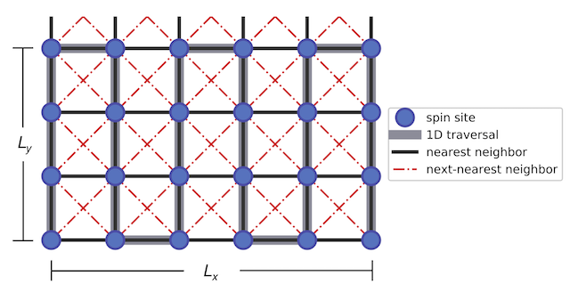

DMRG.x
======

A distributed-memory implementation of the DMRG algorithm based on the [PETSc](https://www.mcs.anl.gov/petsc/) and
[SLEPc](http://slepc.upv.es/) libraries.

The Density Matrix Renormalization Group (DMRG) algorithm is a numerical technique used in the study of low-dimensional
strongly correlated quantum systems. With this implementation, one can study two-dimensional spin systems using a one-dimensional
traversal of the lattice.

In particular, the current version deals with a **square-type lattice** with longitudinal dimension *Lx* and transverse
dimension *Ly* shown in the following figure.
The spin sites can interact with their nearest neighbor (NN) and next-nearest neighbors (NNN), and different boundary conditions may be implemented on the two directions (such as the cylindrical boundary conditions illustrated below).

The Hamiltonian for this implementation takes the form:

which maps to a Heisenberg model when J₁ = 1/2 and J₂ = Δ₂ = 0, and to the J1-J2 XY model when Δ₁ = Δ₂ = 0.

Documentation
-------------

Additional documentation may be found in the following pages under the docs folder:

 - [Usage](docs/usage.md)

To generate the corresponding Doxygen documentation, go to the root directory and execute

    make docs

This will place the documentation in docs/latex and docs/html.

**NOTE:**
Since the same markdown files were used in generating documentation with doxygen, some links may be available only for the
markdown/github version (links marked as **[md]**) and others may work only for the doxygen version (marked as **[dox]**).

References
----------

For more information on the DMRG algorithm, we recommend the following reading materials:
 - U. Schollwöck. "The density-matrix renormalization group." Rev. Mod. Phys. 77, 259 – Published 26 April 2005
    [[doi](https://doi.org/10.1103/RevModPhys.77.259)]
 - A E Feiguin. "The Density Matrix Renormalization Group". In: Strongly Correlated Systems. Berlin, Heidelberg: Springer Berlin Heidelberg, Apr. 2013, pp. 31–65. [[link](https://www.springer.com/cda/content/document/cda_downloaddocument/9783642351051-c2.pdf?SGWID=0-0-45-1391718-p174727662)]

<!--
Table of Contents
-----------------
 - [Prerequisites](#prerequisites)
 - [Installation](#installation)
 - [Usage](#usage)
 - [Contributing](#contributing)
 - [Credits](#credits)
 - [License](#license)

Prerequisites
-------------

Installation
------------

Usage
-----

Contributing
------------
-->

Credits
-------
This application was developed as part of a [thesis](http://hdl.handle.net/20.500.11767/68070) for the [Master in High Performance Computing](http://www.mhpc.it)
in collaboration with the [Condensed Matter and Statistical Physics Section](https://www.ictp.it/research/cmsp.aspx) of the
[The Abdus Salam International Centre for Theoretical Physics](http://www.ictp.it).

<!--
License
-------
-->
